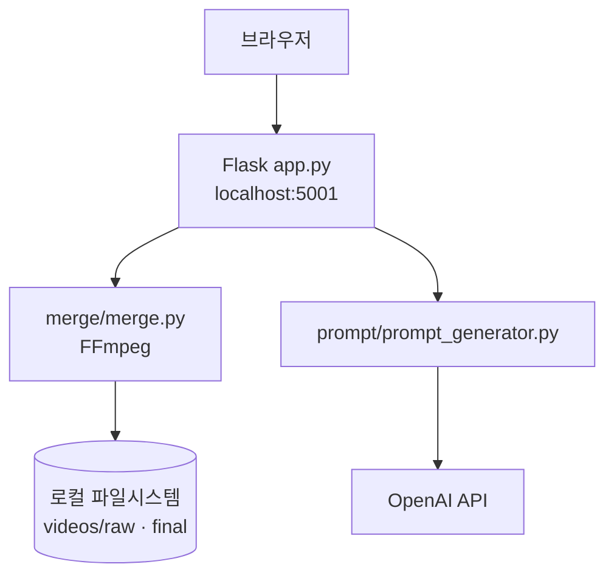

# clips


영상 병합과 AI 프롬프트 생성 기능을 제공하는 웹 기반 도구입니다. AI SNS 콘텐츠 제작 파이프라인의 일부로 활용했습니다.

| 항목 | 내용 |
|------|------|
| **상태** | 개발 완료 (로컬) |
| **유형** | 개인 프로젝트 (1인) |
| **관련** | AI SNS (나노바나나 프로) 콘텐츠 제작 |

---

## 목차

- [소개](#소개)
- [주요 기능](#주요-기능)
- [기술 스택](#기술-스택)
- [시스템 구조](#시스템-구조)
- [데이터 저장](#데이터-저장)
- [외부 API 키 및 필수 기능](#외부-api-키-및-필수-기능)
- [프로젝트 구조](#프로젝트-구조)
- [시작하기](#시작하기)
- [페이지](#페이지)
- [보안 · API 키 관리](#보안--api-키-관리)
- [참고](#참고)

---

## 소개

clips는 여러 짧은 영상을 하나로 병합하고, 주제를 입력하면 바이럴 프롬프트·훅·해시태그를 자동 생성하는 Flask 웹 앱입니다. ASMR 영상(`asmr`)과 고양이 여행 이미지(`meow`) 등 콘셉트별 프롬프트 템플릿을 지원합니다.

---

## 주요 기능

| 기능 | 설명 |
|------|------|
| **영상 병합** | 드래그 앤 드롭, 순서 조정, 텍스트 오버레이, 출력 비율 (4:5, 9:16, 16:9, 1:1) |
| **AI 프롬프트 생성** | 주제 입력 → 바이럴 프롬프트, 훅, 해시태그 자동 생성 |
| | `asmr` — ASMR 영상용 (4:5 비율) |
| | `meow` — 3고양이 여행 이미지용 (극사실주의 스타일) |
| **웹 UI** | Flask 대시보드로 모든 기능 사용 |

---

## 기술 스택

| 영역 | 기술 |
|------|------|
| **Backend** | Python 3.9+, Flask 3 |
| **영상 처리** | FFmpeg, Pillow |
| **AI** | OpenAI API (GPT-4o) |
| **기타** | python-dotenv, Playwright (자동 업로드 확장용) |

---

## 시스템 구조



---

## 데이터 저장

clips는 **DB를 사용하지 않습니다**. 모든 데이터는 로컬 파일시스템에 저장됩니다.

| 경로 | 내용 |
|------|------|
| `video-merger/videos/raw/` | 업로드된 원본 영상 |
| `video-merger/videos/final/` | 병합 완료 결과물 |
| `.env` | API 키 (gitignore) |


---

## 외부 API 키 및 필수 기능

| 환경 변수 | 필수 | 연동 기능 | 없을 때 |
|-----------|------|-----------|---------|
| `OPENAI_API_KEY` | AI 프롬프트 사용 시 | `/ai-prompt` GPT-4o 생성 | 프롬프트 생성 API 오류 |
| FFmpeg | 영상 병합 시 | `/merge` 인코딩·concat | 병합 기능 불가 |

> 영상 병합(`/merge`)만 사용할 경우 `OPENAI_API_KEY` 없이도 동작합니다.

---

## 프로젝트 구조

```
clips/
└── video-merger/
    ├── app.py              # Flask 메인 서버 (포트 5001)
    ├── merge/              # 영상 병합 로직
    ├── prompt/             # AI 프롬프트 생성
    ├── templates/          # HTML 템플릿
    ├── static/             # 정적 파일
    ├── videos/
    │   ├── raw/            # 원본 영상
    │   └── final/          # 병합 결과
    ├── requirements.txt
    └── env.example
```

---

## 시작하기

### 사전 요구사항

- Python 3.9+
- FFmpeg

### 1. FFmpeg 설치

```bash
# Mac
brew install ffmpeg

# Ubuntu/Debian
sudo apt update && sudo apt install ffmpeg
```

### 2. 설치

```bash
cd video-merger
pip3 install -r requirements.txt
```

### 3. 환경 변수

```bash
cp env.example .env
# OPENAI_API_KEY 입력 (AI 프롬프트 사용 시)
```

### 4. 실행

```bash
python3 app.py
```

브라우저에서 `http://localhost:5001` 접속

---

## 페이지

| 경로 | 설명 |
|------|------|
| `/` | 메인 대시보드 |
| `/merge` | 영상 병합 |
| `/ai-prompt` | AI 프롬프트 생성 |

### 영상 병합 사용법

1. `/merge` 페이지 접속
2. 영상 파일 드래그 앤 드롭 또는 선택
3. 드래그로 순서 조정 (선택)
4. 상단 텍스트 오버레이 입력 (선택)
5. 출력 비율 선택 (기본 4:5)
6. **영상 병합 시작** 클릭
7. `videos/final/` 폴더에서 결과 확인

---

## 보안 · API 키 관리

| 항목 | 상태 | 비고 |
|------|------|------|
| `OPENAI_API_KEY` 하드코딩 | ✅ 없음 | `os.getenv` + `.env` |
| `.env` gitignore | ✅ | 루트 및 `video-merger/` |
| Chrome Web Store | 해당 없음 | 웹 앱 (로컬 실행) |

---

## 참고

- 병합 출력: CRF 10, veryslow preset (고화질)
- Playwright·Google API 패키지는 자동 업로드 확장용 (선택)
- 상세 문서: [docs/](docs/)
